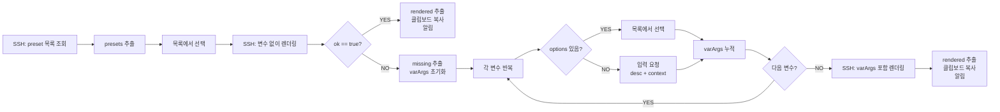

# iOS Shortcut 기반 프롬프트 모바일 원탭 복사

iPhone에서 prompt preset을 선택하고 변수를 입력하면, MiniPC에서 렌더링된 프롬프트가 클립보드에 복사된다.

## 전제조건

- iPhone에 Tailscale 설치 + VPN 연결
- Shortcuts 앱 (기본 설치)
- MiniPC에 SSH 키 등록 완료

## Quick Start

### 1. SSH 키 생성

iPhone의 Shortcuts 앱에서 SSH 키를 생성한다:

1. Shortcuts 앱 → 새 Shortcut → `Run Script over SSH` 액션 추가
2. Host: MiniPC의 Tailscale IP, User: `greenhead`
3. Authentication: `SSH Key` 선택
4. `Generate New Key` (Ed25519 권장)
5. 생성된 공개키를 복사하여 프로젝트 관리자에게 전달

### 2. MiniPC에 키 등록

`libraries/constants.nix`의 `sshKeys.iphoneShortcuts` 값을 실제 공개키로 교체한 뒤 `nrs` 적용.

### 3. Shortcut 빌드

아래 "Shortcut 액션 상세" 섹션을 따라 Shortcut을 구성한다.

### 4. 검증

1. Tailscale VPN 연결 확인
2. Shortcut 실행 → `bugfix` 선택 → 클립보드에 프롬프트가 복사되는지 확인
3. `feature-dev-full` 선택 → 변수 3개를 목록에서 선택 → 클립보드 확인
4. `exploration` 선택 → 자유 텍스트 입력 → 클립보드 확인

---

## 서버 응답 구조

모든 SSH 명령은 `--format json`으로 호출하며, 응답은 아래 구조를 따른다.

### 성공 응답 (변수 없는 preset)

```json
{
  "ok": true,
  "preset": "bugfix",
  "rendered": "YAGNI/NGMI를 제1원칙으로 삼아, 버그 원인을 먼저 좁혀...",
  "missing": [],
  "invalid": [],
  "error": ""
}
```

### 실패 응답 (미입력 변수 존재)

`missing` 배열에 각 변수의 메타데이터가 포함된다:

```json
{
  "ok": false,
  "preset": "feature-dev-full",
  "rendered": "",
  "missing": [
    {
      "name": "DA_TOOL",
      "desc": "코드 실행 도구",
      "context": "___로 DA 리뷰를 수행해. 모델은 DA_MODEL_1을 명시해.",
      "options": ["codex exec", "claude agent"],
      "default": "codex exec"
    },
    {
      "name": "DA_MODEL_1",
      "desc": "1차 DA 모델",
      "context": "DA_TOOL로 DA 리뷰를 수행해. 모델은 ___을 명시해.",
      "options": ["gpt-5.3-codex", "claude-opus-4-6"],
      "default": "gpt-5.3-codex"
    }
  ],
  "invalid": [],
  "error": "missing variables: DA_TOOL, DA_MODEL_1"
}
```

### missing 객체 필드 해석

| 필드 | 의미 | 예시 | Shortcut 동작 |
|------|------|------|--------------|
| `name` | 변수명 | `"DA_TOOL"` | `--var` 키로 사용 |
| `desc` | 사람이 읽는 설명 | `"코드 실행 도구"` | 프롬프트에 표시 |
| `context` | 템플릿에서 해당 변수 주변 텍스트 (`___`가 변수 위치) | `"___로 DA 리뷰를 수행해."` | 자유 텍스트 입력 시 맥락 표시 |
| `options` | 선택 가능한 값 목록 (빈 배열이면 자유 텍스트) | `["codex exec", "claude agent"]` | 비어있지 않으면 "목록에서 선택" |
| `default` | 기본값 (`null`이면 없음) | `"codex exec"` | "입력 요청"의 기본 응답에 사용 |

### 변수 유형 판별 규칙

```text
options가 비어있지 않다 → 선택형 변수 → "목록에서 선택" (Choose from List)
options가 비어있다     → 자유 텍스트  → "입력 요청" (Ask for Input) + desc/context 표시
```

---

## 전체 흐름 개요

### 플로우차트



### 액션 구조도

```text
Phase 1: Preset 선택
 ┌──────────────────────────────────────────────────────────┐
 │ [1] SSH ─ preset 목록 조회                                │
 │ [2] 사전에서 값 가져오기 (key: presets)                     │
 │ [3] 목록에서 선택                                         │
 │ [4] 변수 설정: selectedPreset                             │
 └──────────────────────────────────────────────────────────┘

Phase 2: 렌더링 시도
 ┌──────────────────────────────────────────────────────────┐
 │ [5] SSH ─ 변수 없이 렌더링                                │
 │ [6] 변수 설정: renderResult                               │
 │ [7] 사전에서 값 가져오기 (key: ok, 유형: 텍스트)             │
 │ [8] 조건: ok 같음 "true"                                  │
 └──────────────────────────────────────────────────────────┘

Phase 3-A: 성공 (If 블록)           Phase 3-B: 변수 입력 필요 (Otherwise)
 ┌─────────────────────────┐        ┌─────────────────────────────────┐
 │ [9]  rendered 추출        │        │ [12] missing 추출                │
 │ [10] 클립보드 복사         │        │ [13] 변수 설정: missingVars      │
 │ [11] 알림                │        │ [14] 텍스트: (빈 텍스트)          │
 └─────────────────────────┘        │ [15] 변수 설정: varArgs = ""     │
                                    └─────────────────────────────────┘

Phase 4: 변수 입력 루프
 ┌──────────────────────────────────────────────────────────┐
 │ [16] 각 항목에 대해 반복 (missingVars)                      │
 │  ┌────────────────────────────────────────────────────┐  │
 │  │ [17-18] name 추출 → varName                        │  │
 │  │ [19-20] desc 추출 → varDesc                        │  │
 │  │ [21-22] options 추출 → varOptions                   │  │
 │  │ [23-24] context 추출 → varContext                   │  │
 │  │ [25-26] default 추출 → varDefault                   │  │
 │  │ [27]    항목 수 (varOptions)                         │  │
 │  │ [28]    조건: 항목 수 > 0                            │  │
 │  │  ┌──────────────────┐  ┌─────────────────────────┐ │  │
 │  │  │ If: 선택형 변수    │  │ Otherwise: 자유 텍스트   │ │  │
 │  │  │ [29] 목록에서 선택  │  │ [31] desc+context 조합  │ │  │
 │  │  │ [30] → chosenValue│  │ [32] 입력 요청           │ │  │
 │  │  │                  │  │ [33] → chosenValue      │ │  │
 │  │  └──────────────────┘  └─────────────────────────┘ │  │
 │  │ [34] 조건 종료                                      │  │
 │  │ [35] 텍스트: varArgs --var 'varName=chosenValue'     │  │
 │  │ [36] 변수 설정: varArgs                              │  │
 │  └────────────────────────────────────────────────────┘  │
 │ [37] 반복 종료                                           │
 └──────────────────────────────────────────────────────────┘

Phase 5: 최종 렌더링
 ┌──────────────────────────────────────────────────────────┐
 │ [38] SSH ─ varArgs 포함 최종 렌더링                        │
 │ [39] 사전에서 값 가져오기 (key: rendered)                   │
 │ [40] 클립보드 복사                                        │
 │ [41] 알림                                                │
 └──────────────────────────────────────────────────────────┘

 [42] 조건 종료 (Phase 2의 [8] 닫기)
```

---

## SSH 명령 레퍼런스

### PATH 설정 (모든 SSH 명령 공통 prefix)

iOS Shortcuts의 `Run Script over SSH`는 non-interactive shell이므로 PATH를 명시 설정해야 한다:

```bash
export PATH="/run/current-system/sw/bin:/etc/profiles/per-user/greenhead/bin:/home/greenhead/.nix-profile/bin:/home/greenhead/.local/bin:$PATH"
```

### 명령 예시

```bash
# preset 목록 조회
prompt-render --list-presets --format json --stdout-only
# → {"ok":true,"presets":["bugfix","code-review",...]}

# 렌더링 (변수 없는 preset → 즉시 성공)
prompt-render --preset bugfix --non-interactive --format json --stdout-only
# → {"ok":true,"rendered":"...","missing":[],...}

# 렌더링 (변수 있는 preset → missing 메타데이터 반환)
prompt-render --preset feature-dev-full --non-interactive --format json --stdout-only
# → {"ok":false,"missing":[{"name":"DA_TOOL","desc":"코드 실행 도구","options":["codex exec","claude agent"],...}],...}

# 렌더링 (변수 전달 → 성공)
prompt-render --preset feature-dev-full \
  --var 'DA_TOOL=codex exec' \
  --var 'DA_MODEL_1=gpt-5.3-codex' \
  --var 'DA_MODEL_2=gpt-5.3-codex' \
  --non-interactive --format json --stdout-only
# → {"ok":true,"rendered":"...","missing":[],...}
```

---

## Shortcut 액션 상세

> **빌드 전 필수 확인사항**
>
> - 모든 SSH 액션의 **"입력"** 필드는 **반드시 비워둔다**. "반복 결과" 등의 값이 들어가면 SSH가 해당 값을 stdin으로 전달하여 오동작한다.
> - `사전에서 값 가져오기`에서 **유형** 설정에 주의한다. 기본값 "파일"로 두면 빈 값이 반환될 수 있다.
> - `ok` 필드 비교 시 반드시 **유형: 텍스트**, **조건: 같음**, **값: `true`** 를 사용한다. `rendered`의 "값이 있음"으로 분기하면 안 된다 (`rendered: ""`도 iOS에서 "값이 있음"으로 평가되기 때문).

### Phase 1: Preset 선택 (액션 1-4)

preset 목록을 서버에서 가져와 사용자에게 보여주고, 하나를 선택받는다.

#### 액션 1. SSH를 통해 스크립트 실행

| 설정 | 값 |
|------|-----|
| Host | MiniPC Tailscale IP |
| User | `greenhead` |
| Auth | SSH Key |
| 입력 | **(비워둠)** |

**스크립트**:

```bash
export PATH="/run/current-system/sw/bin:/etc/profiles/per-user/greenhead/bin:/home/greenhead/.nix-profile/bin:/home/greenhead/.local/bin:$PATH" && prompt-render --list-presets --format json --stdout-only
```

#### 액션 2. 사전에서 값 가져오기

| 설정 | 값 |
|------|-----|
| 키 | `presets` |
| 대상 | `SSH 결과` (액션 1) |

#### 액션 3. 목록에서 선택

| 설정 | 값 |
|------|-----|
| 목록 | `사전 값` (액션 2) |
| 프롬프트 | `Preset 선택` |
| 여러 항목 선택 | 끔 |

#### 액션 4. 변수 설정

| 설정 | 값 |
|------|-----|
| 변수 이름 | `selectedPreset` |
| 값 | `선택한 항목` (액션 3) |

---

### Phase 2: 렌더링 시도 (액션 5-8)

선택한 preset을 변수 없이 렌더링을 시도한다. 변수가 없는 preset (bugfix 등)은 여기서 바로 성공한다.

#### 액션 5. SSH를 통해 스크립트 실행

| 설정 | 값 |
|------|-----|
| 입력 | **(비워둠)** |

**스크립트**:

```bash
export PATH="/run/current-system/sw/bin:/etc/profiles/per-user/greenhead/bin:/home/greenhead/.nix-profile/bin:/home/greenhead/.local/bin:$PATH" && prompt-render --preset "$(printf '%s' '[selectedPreset]' | tr -d '\n\r')" --non-interactive --format json --stdout-only
```

> `[selectedPreset]` 부분에 `selectedPreset` 매직 변수를 삽입한다.
>
> **`printf | tr -d '\n\r'`가 필요한 이유**: iOS Shortcuts의 "목록에서 선택"은 선택된 값에 줄바꿈(`\n`)을 추가한다. 이를 제거하지 않으면 `preset not found: \nbugfix` 에러가 발생한다.

#### 액션 6. 변수 설정

| 설정 | 값 |
|------|-----|
| 변수 이름 | `renderResult` |
| 값 | `SSH 결과` (액션 5) |

> 이후 Phase 3-A와 3-B에서 이 결과를 여러 번 참조해야 하므로 변수에 저장한다.

#### 액션 7. 사전에서 값 가져오기

| 설정 | 값 |
|------|-----|
| 키 | `ok` |
| **유형** | **텍스트** (중요!) |
| 대상 | `renderResult` |

#### 액션 8. 조건 (If)

| 설정 | 값 |
|------|-----|
| 입력 | `사전 값` (액션 7) |
| 조건 | `같음` |
| 값 | `true` |

> **왜 `ok` 필드를 텍스트로 비교하나?**
>
> `rendered` 필드의 존재 여부로 분기하면 안 된다. `ok: false`일 때 `rendered: ""`(빈 문자열)인데, iOS Shortcuts는 빈 문자열도 "값이 있음"으로 평가하기 때문이다. 따라서 `ok` 필드를 **텍스트** 유형으로 추출하여 문자열 `"true"`와 비교하는 것이 정확하다.

---

### Phase 3-A: 성공 처리 (액션 9-11) — If 블록 안쪽

변수가 없거나 이미 모두 전달된 경우. `rendered`를 클립보드에 복사한다.

#### 액션 9. 사전에서 값 가져오기

| 설정 | 값 |
|------|-----|
| 키 | `rendered` |
| 유형 | 텍스트 |
| 대상 | `renderResult` |

#### 액션 10. 클립보드에 복사

| 설정 | 값 |
|------|-----|
| 대상 | `사전 값` (액션 9) |

#### 액션 11. 알림 표시

| 설정 | 값 |
|------|-----|
| 제목 | `Prompt 복사 완료` |
| 본문 | `selectedPreset` |

---

### Phase 3-B: 변수 입력 준비 (액션 12-15) — Otherwise 블록 안쪽

`ok: false`이고 `missing` 배열이 있는 경우. 변수 입력 루프를 준비한다.

#### 액션 12. 사전에서 값 가져오기

| 설정 | 값 |
|------|-----|
| 키 | `missing` |
| 대상 | `renderResult` |

#### 액션 13. 변수 설정

| 설정 | 값 |
|------|-----|
| 변수 이름 | `missingVars` |
| 값 | `사전 값` (액션 12) |

#### 액션 14. 텍스트

| 설정 | 값 |
|------|-----|
| 내용 | (비워둠 — 빈 텍스트) |

#### 액션 15. 변수 설정

| 설정 | 값 |
|------|-----|
| 변수 이름 | `varArgs` |
| 값 | `텍스트` (액션 14) |

> `varArgs`를 빈 문자열로 초기화한다. 이후 루프에서 `--var 'KEY=VALUE'`를 누적한다.

---

### Phase 4: 변수 입력 루프 (액션 16-37)

`missing` 배열의 각 변수에 대해, 메타데이터를 기반으로 적절한 입력 UI를 보여주고 값을 수집한다.

#### 액션 16. 각 항목에 대해 반복 (Repeat with Each)

| 설정 | 값 |
|------|-----|
| 목록 | `missingVars` |

> `missing` 배열의 각 객체(`{name, desc, context, options, default}`)를 순회한다.

---

**(이하 액션 17-36은 루프 내부)**

#### 메타데이터 추출 (액션 17-26)

각 `반복 항목`에서 5개 필드를 추출하여 변수에 저장한다:

| 액션 | 동작 | 키 | 변수 이름 |
|------|------|-----|----------|
| 17-18 | 사전에서 값 가져오기 → 변수 설정 | `name` | `varName` |
| 19-20 | 사전에서 값 가져오기 → 변수 설정 | `desc` | `varDesc` |
| 21-22 | 사전에서 값 가져오기 → 변수 설정 | `options` | `varOptions` |
| 23-24 | 사전에서 값 가져오기 → 변수 설정 | `context` | `varContext` |
| 25-26 | 사전에서 값 가져오기 → 변수 설정 | `default` | `varDefault` |

> 모든 `사전에서 값 가져오기`의 **대상**은 `반복 항목` (매직 변수)이다.

#### 액션 27. 항목 수 (Count)

| 설정 | 값 |
|------|-----|
| 대상 | `varOptions` |

> options 배열의 항목 수를 센다. `["codex exec", "claude agent"]` → 2, `[]` → 0

#### 액션 28. 조건 (If) — 선택형 vs 자유 텍스트 분기

| 설정 | 값 |
|------|-----|
| 입력 | `항목 수` (액션 27) |
| 조건 | `보다 큼` |
| 값 | `0` |

---

#### If 블록: 선택형 변수 (options가 있는 경우)

`DA_TOOL`, `DA_MODEL_1` 등 값이 정해져 있는 변수. 사용자에게 목록을 보여주고 선택받는다.

##### 액션 29. 목록에서 선택

| 설정 | 값 |
|------|-----|
| 목록 | `varOptions` |
| 프롬프트 | `varDesc` (매직 변수) |

> 화면 예시: 프롬프트 "코드 실행 도구" 아래에 ["codex exec", "claude agent"] 목록이 표시된다.

##### 액션 30. 변수 설정

| 설정 | 값 |
|------|-----|
| 변수 이름 | `chosenValue` |
| 값 | `선택한 항목` (액션 29) |

---

#### Otherwise 블록: 자유 텍스트 변수 (options가 비어있는 경우)

`TARGET`, `LEARN_TARGET` 등 자유 입력 변수. 설명과 맥락 텍스트를 보여주고 입력받는다.

##### 액션 31. 텍스트

| 설정 | 값 |
|------|-----|
| 내용 | (아래 참조) |

내용 구성:

```text
[varDesc]

[varContext]
```

> `[varDesc]`와 `[varContext]`는 각각 매직 변수로 삽입한다.
>
> 화면 예시: `"조사할 대상 (파일, 모듈, 동작 등)\n\n___을 조사해. 코드를 변경하지 말고 아래를 정리해:"`

##### 액션 32. 입력 요청 (Ask for Input)

| 설정 | 값 |
|------|-----|
| 유형 | 텍스트 |
| 프롬프트 | `텍스트` (액션 31의 매직 변수) |
| 기본 응답 | `varDefault` (매직 변수) |

> `default`가 `null`이면 iOS가 "기본 응답"을 비워둔다 → 사용자가 직접 입력한다.
> `default`에 값이 있으면 미리 채워진 상태로 표시된다.

##### 액션 33. 변수 설정

| 설정 | 값 |
|------|-----|
| 변수 이름 | `chosenValue` |
| 값 | `제공된 입력` (액션 32의 매직 변수) |

> **"제공된 입력"을 찾는 방법**: 키보드 상단의 변수 바에서 "입력 요청" 액션의 출력 항목을 탭한다. "제공된 입력"이라는 이름으로 표시된다.

---

#### 액션 34. 조건 종료 (End If)

액션 28의 If를 닫는다.

#### 액션 35. 텍스트 — varArgs 누적

| 설정 | 값 |
|------|-----|
| 내용 | (아래 참조) |

내용 구성:

```text
[varArgs] --var '[varName]=[chosenValue]'
```

> `[varArgs]`, `[varName]`, `[chosenValue]`는 각각 매직 변수로 삽입한다.
>
> 누적 예시 (feature-dev-full, 3번 반복 후):
> `--var 'DA_TOOL=codex exec' --var 'DA_MODEL_1=gpt-5.3-codex' --var 'DA_MODEL_2=gpt-5.3-codex'`

#### 액션 36. 변수 설정

| 설정 | 값 |
|------|-----|
| 변수 이름 | `varArgs` |
| 값 | `텍스트` (액션 35) |

---

#### 액션 37. 반복 종료 (End Repeat)

액션 16의 반복을 닫는다.

---

### Phase 5: 최종 렌더링 + 클립보드 복사 (액션 38-42)

누적된 `varArgs`와 함께 서버에 최종 렌더링을 요청하고, 결과를 클립보드에 복사한다.

#### 액션 38. SSH를 통해 스크립트 실행

| 설정 | 값 |
|------|-----|
| 입력 | **(비워둠)** |

**스크립트**:

```bash
export PATH="/run/current-system/sw/bin:/etc/profiles/per-user/greenhead/bin:/home/greenhead/.nix-profile/bin:/home/greenhead/.local/bin:$PATH" && prompt-render --preset "$(printf '%s' '[selectedPreset]' | tr -d '\n\r')" [varArgs] --non-interactive --format json --stdout-only
```

> `[selectedPreset]`과 `[varArgs]`에 각각 매직 변수를 삽입한다.
>
> 최종 명령 예시:
> ```bash
> prompt-render --preset "$(printf '%s' 'feature-dev-full' | tr -d '\n\r')" --var 'DA_TOOL=codex exec' --var 'DA_MODEL_1=gpt-5.3-codex' --var 'DA_MODEL_2=gpt-5.3-codex' --non-interactive --format json --stdout-only
> ```

#### 액션 39. 사전에서 값 가져오기

| 설정 | 값 |
|------|-----|
| 키 | `rendered` |
| 유형 | 텍스트 |
| 대상 | `SSH 결과` (액션 38) |

#### 액션 40. 클립보드에 복사

| 설정 | 값 |
|------|-----|
| 대상 | `사전 값` (액션 39) |

#### 액션 41. 알림 표시

| 설정 | 값 |
|------|-----|
| 제목 | `Prompt 복사 완료` |
| 본문 | `selectedPreset` |

#### 액션 42. 조건 종료 (End If)

Phase 2의 액션 8의 If를 닫는다.

---

## 사용자 경험 예시

### bugfix (변수 없음)

```text
Preset 선택 → bugfix 탭
→ 즉시 클립보드에 복사
→ 알림: "Prompt 복사 완료 — bugfix"
```

### feature-dev-full (선택형 변수 3개)

```text
Preset 선택 → feature-dev-full 탭
→ "코드 실행 도구" — [codex exec / claude agent] 중 선택
→ "1차 DA 모델"   — [gpt-5.3-codex / claude-opus-4-6] 중 선택
→ "2차 DA 모델"   — [gpt-5.3-codex / claude-opus-4-6] 중 선택
→ 클립보드에 복사
→ 알림: "Prompt 복사 완료 — feature-dev-full"
```

### exploration (자유 텍스트 변수)

```text
Preset 선택 → exploration 탭
→ 프롬프트 표시:
  "조사할 대상 (파일, 모듈, 동작 등)

   ___을 조사해. 코드를 변경하지 말고 아래를 정리해:"
→ 사용자: "tmux resurrect 플러그인" 입력
→ 클립보드에 복사
→ 알림: "Prompt 복사 완료 — exploration"
```

---

## 선택적 개선: 기본값 전체 적용

모든 `missing` 변수에 `default`가 있을 때 (feature-dev-full, feature-dev-light), 입력 루프 없이 한 번에 기본값을 적용하는 최적화이다.

**Phase 3-B (액션 15)와 Phase 4 (액션 16) 사이에 추가한다**:

1. `변수 설정` — `allDefaultsAvailable` = `true`
2. `각 항목에 대해 반복` — `missingVars`
   - `사전에서 값 가져오기` — key: `default`, 대상: `반복 항목`
   - `조건` (If) — `사전 값`이 `값이 없음` (has no value)
     - `변수 설정` — `allDefaultsAvailable` = `false`
   - `조건 종료`
3. `반복 종료`
4. `조건` (If) — `allDefaultsAvailable` `같음` `true`
5. `메뉴에서 선택`
   - 선택지 1: `기본값 사용`
   - 선택지 2: `직접 입력`
6. **기본값 사용** 분기:
   - `각 항목에 대해 반복` — `missingVars`
     - `사전에서 값 가져오기` — key: `name`, 대상: `반복 항목`
     - `사전에서 값 가져오기` — key: `default`, 대상: `반복 항목`
     - `텍스트` — `[varArgs] --var '[name]=[default]'` (매직 변수로 삽입)
     - `변수 설정` — `varArgs`
   - `반복 종료`
   - → Phase 5 (액션 38)로 이동 (변수 입력 루프를 건너뜀)
7. **직접 입력** 분기: → Phase 4 (액션 16)의 변수 입력 루프로 진행
8. `조건 종료`

> `default`가 `null`인 변수가 하나라도 있으면 (exploration의 TARGET 등) 이 최적화는 작동하지 않고 바로 입력 루프로 진입한다.

---

## 트러블슈팅

| 증상 | 원인 | 해결 |
|------|------|------|
| SSH 연결 시간 초과 | VPN 미연결 | Tailscale 앱에서 VPN 연결 확인 |
| "Permission denied" | SSH 키 미등록 | `libraries/constants.nix` → `sshKeys.iphoneShortcuts` / `macShortcuts` 확인 후 `nrs` |
| "SSH 키 인증 실패" (macOS) | 잘못된 공개키 등록 | 아래 **macOS 단축어 SSH 키 주의사항** 참조 |
| "command not found: prompt-render" | PATH 미설정 | SSH 명령에 PATH export 포함 확인 |
| "jq not found" | Home Manager PATH 누락 | PATH에 `/etc/profiles/per-user/greenhead/bin` 포함 확인 |
| `preset not found: \nbugfix` | "목록에서 선택"이 줄바꿈 추가 | SSH 명령에 `printf '%s' ... \| tr -d '\n\r'` 사용 |
| 클립보드에 빈 값 복사 | `rendered` 유형이 "파일" | `사전에서 값 가져오기`에서 유형을 **텍스트**로 설정 |
| `ok: false`인데 성공 분기 진입 | `rendered: ""` 를 "값이 있음"으로 평가 | `ok` 필드를 유형 **텍스트**로 추출 → `같음` `"true"` 비교 |
| 변수 입력 화면이 여러 개 동시 표시 | SSH 액션의 "입력" 필드에 값이 들어감 | SSH 액션의 **"입력" 필드를 비워둠** |
| "제공된 입력" 변수를 못 찾음 | 매직 변수 탐색 방법 모름 | 키보드 상단 변수 바에서 "입력 요청" 출력 탭 |
| Tailscale SSH 사용 시 에러 | Tailscale SSH 버그 | 전통 sshd 사용 (기본 설정) |

### macOS 단축어 SSH 키 주의사항

macOS 단축어 앱의 SSH 키는 iOS와 다르게 동작한다.

**"새로운 키 생성" 버튼을 누르지 말 것.**

- macOS 단축어 앱은 기기에 **고정된 기본 SSH 키**를 가지고 있다.
- "새로운 키 생성" 버튼으로 새 키를 발급할 수 있지만, **앱을 종료 후 재시작하면 기본 키로 리셋**된다.
- 즉, 새로 발급한 키의 공개키를 서버에 등록해도, 다음 실행 시 리셋된 기본 키로 접속을 시도하므로 인증 실패.

**올바른 등록 절차:**

1. 단축어 앱에서 SSH 액션의 "SSH 키" 클릭
2. **"새로운 키 생성"을 누르지 않고** 기본 키 상태에서 "공개 키 복사"
3. 해당 키를 `libraries/constants.nix` → `sshKeys.macShortcuts`에 등록
4. `nrs` 적용

**진단 방법 (핑거프린트 불일치 시):**

```bash
# sshd LogLevel을 임시로 DEBUG로 변경 후 nrs 적용, 단축어 실행, 로그 확인:
sudo journalctl -u sshd -n 30 --no-pager | grep "pubkey\|Failed"
# → "pkblob ED25519 SHA256:xxx" 의 핑거프린트와 등록된 키의 핑거프린트를 대조
```

---

## Fallback: `push()` 사용법

VPN/SSH가 불가한 상황에서는 Mac 또는 MiniPC 터미널에서 `push()` 함수를 사용:

```bash
push "$(prompt-render --preset bugfix --non-interactive --stdout-only)"
```

> 1024자 제한 주의. 긴 프롬프트는 잘릴 수 있다.

---

## 보안 정책

- **Tailscale VPN 전용**: 공용 인터넷 노출 없음
- **비밀정보 하드코딩 금지**: SSH 키, API 키 등을 Shortcut에 직접 입력하지 않음
- **SSH 키 인증만 사용**: 비밀번호 인증 비활성화
