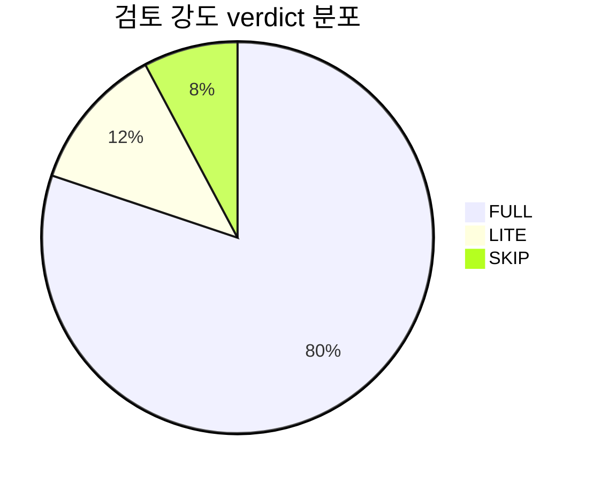

# Output Format

`analyze.py`는 같은 aggregate 객체를 입력으로 받아 markdown stdout + JSON sidecar를 동시에 렌더링한다. 두 출력의 metric 값은 절대 어긋나지 않는다 (단일 source).

## markdown stdout 형식

### Header

```markdown
# DA 세션 정량 분석 — <ISO timestamp>

| 항목 | 값 |
|------|-----|
| 호스트 | mac, minipc (또는 사용자 명시) |
| corpus | live (또는 manifest snapshot_id) |
| 분석 파일 수 | <total jsonl count> |
| Arbiter marker 세션 | <count> |
| Intensity marker 세션 | <count> |
```

### M-1: 검토 강도 verdict 분포

```markdown
## M-1: 검토 강도 verdict 분포 (n=<intensity_marker_sessions>)

| verdict | 카운트 | 비율 |
|---------|--------|------|
| FULL | 113 | 80.3% |
| LITE | 17 | 12.1% |
| SKIP | 11 | 7.6% |


```

### M-2: 판정자 verdict 분포

```markdown
## M-2: 판정자 verdict 분포 (n=<finding count, high+medium confidence subset>)

| verdict | 카운트 | 비율 |
|---------|--------|------|
| CONFIRMED_ISSUE | 4291 | 83.6% |
| NOT_AN_ISSUE | 647 | 12.6% |
| NEEDS_MORE_INFO | 134 | 2.6% |

source 분포:
- verdict_json (high): 4521 (88.1%)
- md_header (high): 312 (6.1%)
- json_unmarked (high): 89 (1.7%)
- kv (medium): 150 (2.9%)
- (nl_summary low — finding-level 분포 미포함)
```

### M-3: reviewer 묶음별 confirmed-rate

```markdown
## M-3: reviewer 묶음별 confirmed-rate

| 묶음 | total | CONFIRMED_ISSUE | confirmed-rate |
|------|-------|-----------------|----------------|
| Correctness | 1234 | 1088 | 88.2% |
| Design | 856 | 766 | 89.5% |
| Regression | 423 | 372 | 88.0% |
| Maintainability | 412 | 394 | 95.6% |
```

### M-4: 동일 세션 max severity 전이

```markdown
## M-4: 동일 세션 max severity 전이 매트릭스

| from \\ to | NONE | LOW | MEDIUM | HIGH | CRITICAL |
|------------|------|-----|--------|------|----------|
| NONE | 0 | 5 | 12 | 8 | 1 |
| LOW | 0 | 3 | 7 | 2 | 0 |
| MEDIUM | 2 | 4 | 28 | 11 | 0 |
| HIGH | 1 | 2 | 9 | 14 | 1 |
| CRITICAL | 0 | 0 | 0 | 0 | 0 |
```

### M-5: selective consistency stability_status 분포

```markdown
## M-5: selective consistency stability_status 분포 (source: round_summary_fallback, n=<selective trigger findings>)

| stability_status | 카운트 |
|------------------|--------|
| stable | 42 |
| split | 7 |
| fragmented | 2 |
```

`source` 필드는 `analyze.py:build_aggregate`가 emit하는 두 값 중 하나만 출력된다:
- `"round_summary_fallback"`: round summary `selective:` 라인이 매치된 경우.
- `"unavailable"`: `selective:` 라인 부재 시. 추정 금지 — 출력 시 분포는 빈 dict.

`fleiss-kappa.py` aggregate envelope 통합은 v1 미구현 (algorithm.md StabilitySource 섹션 참조). 따라서 `"source": "fleiss-kappa.py"`는 emit되지 않는다.

### derived statistics

```markdown
## Derived

- intensity_full_finding_zero_rate: 27.4% (FULL 113건 중 finding 0건 31건)
```

`metrics["M-2"]["source_distribution"]`은 4-tier fallback 각 source(verdict_json / md_header / json_unmarked / kv)의 추출 카운트와 confidence 라벨을 별도 키로 emit한다. 본 derived 섹션과 별개.

### Footer

```markdown
---
JSON sidecar: /tmp/analyze-da-sessions-<ISO>.json (또는 --json out= 명시 경로)
```

## JSON 스키마

자동 sidecar default 경로: `/tmp/analyze-da-sessions-<YYYY-MM-DDTHH-MM-SS>.json`. `--json out=<path>` override 가능.

```json
{
  "schema_version": "1.0",
  "captured_at": "2026-05-05T12:30:00Z",
  "hosts": ["mac", "minipc"],
  "corpus": "live",
  "metrics": {
    "M-1": {
      "denominator": "intensity_marker_sessions",
      "n": 141,
      "distribution": {"FULL": 113, "LITE": 17, "SKIP": 11},
      "percentages": {"FULL": 80.3, "LITE": 12.1, "SKIP": 7.6}
    },
    "M-2": {
      "denominator": "arbiter_marker_sessions_findings_high_medium",
      "n": 5072,
      "distribution": {"CONFIRMED_ISSUE": 4291, "NOT_AN_ISSUE": 647, "NEEDS_MORE_INFO": 134},
      "percentages": {"CONFIRMED_ISSUE": 84.6, "NOT_AN_ISSUE": 12.8, "NEEDS_MORE_INFO": 2.6},
      "source_distribution": {
        "verdict_json": {"count": 4521, "confidence": "high"},
        "md_header": {"count": 312, "confidence": "high"},
        "json_unmarked": {"count": 89, "confidence": "high"},
        "kv": {"count": 150, "confidence": "medium"}
      }
    },
    "M-3": {
      "by_bundle": {
        "Correctness": {"total": 1234, "confirmed": 1088, "confirmed_rate": 0.882},
        "Design": {"total": 856, "confirmed": 766, "confirmed_rate": 0.895},
        "Regression": {"total": 423, "confirmed": 372, "confirmed_rate": 0.880},
        "Maintainability": {"total": 412, "confirmed": 394, "confirmed_rate": 0.956}
      }
    },
    "M-4": {
      "transition_matrix": {
        "NONE->LOW": 5, "NONE->MEDIUM": 12, "NONE->HIGH": 8, "NONE->CRITICAL": 1,
        "LOW->LOW": 3, "LOW->MEDIUM": 7, "LOW->HIGH": 2,
        "MEDIUM->NONE": 2, "MEDIUM->LOW": 4, "MEDIUM->MEDIUM": 28, "MEDIUM->HIGH": 11,
        "HIGH->NONE": 1, "HIGH->LOW": 2, "HIGH->MEDIUM": 9, "HIGH->HIGH": 14, "HIGH->CRITICAL": 1
      }
    },
    "M-5": {
      "source": "round_summary_fallback",
      "n": 51,
      "distribution": {"stable": 42, "split": 7, "fragmented": 2}
    }
  },
  "derived": {
    "intensity_full_finding_zero_rate": 0.274
  },
  "warnings": []
}
```

`warnings`에는 SSH 실패(host별 timeout/binary 부재/nonzero rc), `verdict_json parse failures` 누적, manifest.json read 실패 등 partial result 사유를 기록한다. v1 `analyze.py`는 `partial_failure_count`라는 별도 필드를 emit하지 않는다 — partial 사유는 모두 top-level `warnings` 배열에 자연어로 누적된다.

## GitHub Mermaid 안전 subset

PR comment / 이슈 본문에 markdown 그대로 붙여넣을 때 사용 가능한 syntax만 사용한다:

| syntax | 사용 | 회피 사유 |
|--------|------|----------|
| `pie` | OK | GitHub 정식 지원 |
| `flowchart` | OK | GitHub 정식 지원 |
| `sequenceDiagram` | OK | GitHub 정식 지원 |
| `xychart-beta` | **회피** | 실험적, 일부 환경에서 깨짐 |
| `Sankey` | **회피** | 실험적 |
| `quadrantChart` | **회피** | 실험적 |

본 Skill의 markdown 출력은 `pie` 차트만 사용한다.

## corpus 모드 출력 차이

`--corpus <manifest.json>` 호출 시 다음만 추가:
- header에 `corpus: <snapshot_id>`로 표시 (live가 아닌 pinned).
- `analyzed_files: <count>` 옆에 manifest의 `files.length`와 일치 검증 결과.
- footer에 `corpus baseline 비교: <±delta>` — manifest의 `captured_metric_summary`와 현재 측정값 차이를 PR #670 ±5% 게이트 검증에 사용.

## 자동 sidecar 경로 규칙

- default: `/tmp/analyze-da-sessions-<ISO basic format>.json` (e.g. `/tmp/analyze-da-sessions-2026-05-05T12-30-00.json`).
- `/tmp`는 NixOS/macOS 모두 재시작 시 정리됨 → 디스크 누적 위험 낮음.
- `--json out=<path>`로 override 가능 (영구 저장 의도).
- 같은 aggregate 객체를 markdown renderer + json renderer가 동시 사용 → 두 출력의 값 일치 보장.
